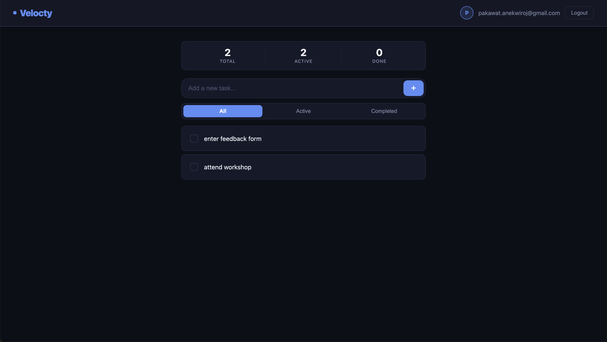
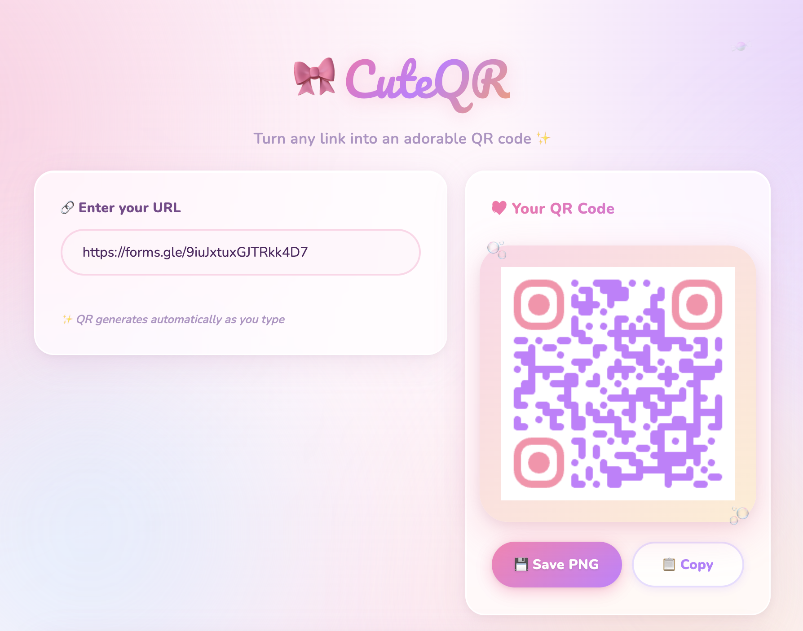
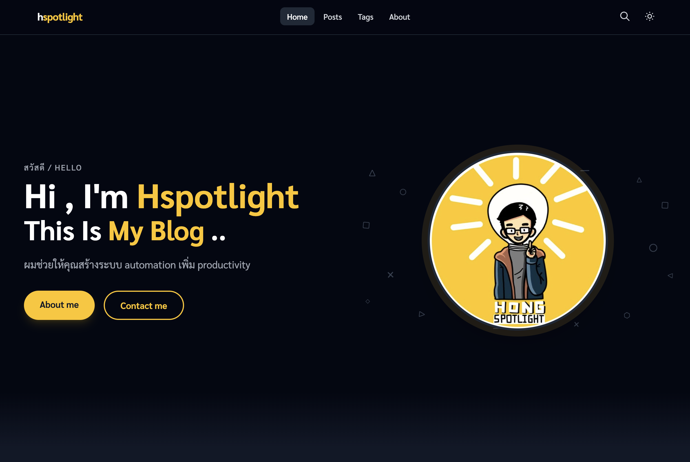

<style>
section {
  background-color: #FEF9EC;
  color: #2D1B00;
  font-family: 'Segoe UI', Arial, sans-serif;
}

h1 { color: #7C4A1E; border-bottom: 3px solid #F5C518; padding-bottom: 6px; }
h2 { color: #7C4A1E; }
h3 { color: #9B5E26; }

/* Quote slides */
section.quote {
  justify-content: center !important;
  text-align: center;
  background-color: #FDF4E0;
}
section.quote blockquote {
  border-left: none;
  background: none;
  font-size: 1.3em;
  font-style: italic;
  color: #2D1B00;
  padding: 0;
  margin: 0 auto 0.6em;
  max-width: 85%;
}
section.quote p {
  font-size: 0.8em;
  color: #7C4A1E;
  font-weight: 600;
}

/* Section title slides */
section.section-title {
  background-color: #E8C96A;
  justify-content: center;
}
section.section-title h1 {
  color: #2D1B00;
  border-bottom: 3px solid #7C4A1E;
  font-size: 2.2em;
}
section.section-title p { color: #5C3A10; }

/* Code */
pre {
  background-color: #FDF0D5;
  border-left: 4px solid #F5C518;
  border-radius: 4px;
}
code { background-color: #FDF0D5; color: #7C4A1E; padding: 1px 4px; border-radius: 3px; }
pre code { background: transparent; color: inherit; padding: 0; }

/* Blockquote */
blockquote {
  border-left: 4px solid #F5C518;
  background-color: #FDF4E0;
  padding: 8px 16px;
  color: #5C3A10;
  margin: 12px 0;
}

/* Tables */
table { border-collapse: collapse; width: 100%; }
th { background-color: #F5C518; color: #2D1B00; font-weight: bold; }
td { border: 1px solid #DEB96A; }
tr:nth-child(even) td { background-color: #FDF4E0; }

/* Pagination with total */
section::after {
  content: attr(data-marpit-pagination) " / " attr(data-marpit-pagination-total);
  color: #9B5E26;
  font-size: 0.7em;
}

/* Intro slide */
section.intro {
  justify-content: flex-start !important;
  padding: 48px 64px 40px;
}
section.intro h1 {
  border-bottom: 2px solid #F5C518;
  margin-bottom: 28px;
  font-size: 1.8em;
}

/* Section progress badge */
footer {
  position: absolute;
  top: 16px;
  right: 20px;
  bottom: auto;
  left: auto;
  font-size: 0.6em;
  color: #7C4A1E;
  background-color: rgba(245, 197, 24, 0.25);
  border: 1px solid #F5C518;
  border-radius: 10px;
  padding: 2px 10px;
  white-space: nowrap;
}
</style>

# 🚀 Zero to SaaS


## เจาะลึก Architecture สร้างธุรกิจด้วย AI ด้วยเงิน 0 บาท

**Stack:** Vanilla HTML/CSS/JS · Firebase · GitHub · Claude Code

**HSpotlight** · 30 April 2026

---

<!-- _class: intro -->

# Nice to meet you 👋

<div style="display:flex;align-items:center;margin-top:8px;">
  <div style="flex-shrink:0;text-align:center;">
    
    <div style="margin-top:14px;font-weight:700;font-size:0.85em;color:#2D1B00;">Pakawat Anekwiroj</div>
  </div>
  <ul style="list-style:none;padding:0;margin:0;font-size:1em;line-height:2;">
    <li>💼 Software Engineer @ Agoda</li>
    <li>🕐 ~8 years in software development</li>
    <li>⚡ Self-development & Sustainable Software</li>
  </ul>
</div>

<p style="position:absolute;bottom:40px;left:64px;font-style:italic;font-size:0.65em;color:#9B5E26;">"I believe in building software that lasts — and teams that grow."</p>

---

<!-- _footer: "Agenda · 1/2" -->

## 📋 Agenda

| # | Section | Time |
|---|---|---|
| 1 | What we're building | 5 min |
| 2 | Setup verification | 10 min |
| 3 | Clone starter repo | 5 min |
| 4 | Claude Code workflow | 20 min |
| 5 | Firebase project setup | 15 min |

---

<!-- _footer: "Agenda · 2/2" -->

## 📋 Agenda (cont.)

| # | Section | Time |
|---|---|---|
| 6 | CI/CD with Firebase CLI | 20 min |
| 7 | Git + env strategy | 15 min |
| 8 | Decision framework | 10 min |
| 9 | Analytics | 5 min |
| 10 | Q&A + What's next | 15 min |

---

## 📜 Ground Rules

1. We will go to the finish line together
2. Feel free to ask questions at any time

---

<!-- _class: quote -->

> "Everything in software architecture is a trade-off."

— Mark Richards & Neal Ford
*First Law of Software Architecture*

---

<!-- _class: section-title -->

# 1. 🏗️ What We're Building

---

<!-- _footer: "What We're Building · 1/3" -->

## 🔗 Link-in-Bio SaaS

A personal page that lists your links — think Linktree.

**Public side**
- Anyone can visit like `https://<app name>.web.app/`
- See profile + clickable links

**Private side**
- Log in to manage your links
- Add, reorder, delete

**Why this app?**
Hosting feels meaningful · Auth makes sense · Firestore is simple · You can personalize it

---

<!-- _footer: "What We're Building · 2/3" -->

## 🎬 Live Demo

> **[TODO: insert your Link-in-Bio URL here]**

**What you will have at the end of today:**
- A deployed Link-in-Bio app on Firebase Hosting
- A CI/CD pipeline that auto-deploys on PR and merge
- Two environments: test and prod

---

<!-- _footer: "What We're Building · 3/3" -->

## 💡 What Can You Build?

<table style="width:100%;table-layout:fixed;border:none;border-collapse:separate;border-spacing:16px;">
  <tr>
    <td style="border:none;text-align:center;background:#FDF4E0;border-radius:12px;padding:16px;vertical-align:top;">
      <a href="https://velocty-ab097.web.app/" target="_blank">
        
      </a>
      <strong style="color:#7C4A1E;">✅ <a href="https://velocty-ab097.web.app/" target="_blank" style="color:#7C4A1E;">Todo App</a></strong><br>
      <small style="color:#5C3A10;">Task management <br>with Auth + Firestore</small>
    </td>
    <td style="border:none;text-align:center;background:#FDF4E0;border-radius:12px;padding:16px;vertical-align:top;">
      <a href="https://cuteqr-prod.web.app/" target="_blank">
        
      </a>
      <strong style="color:#7C4A1E;">🔳 <a href="https://cuteqr-prod.web.app/" target="_blank" style="color:#7C4A1E;">QR Code Generator</a></strong><br>
      <small style="color:#5C3A10;">Generate & save QR codes</small>
    </td>
    <td style="border:none;text-align:center;background:#FDF4E0;border-radius:12px;padding:16px;vertical-align:top;">
      <a href="https://hspotlight.dev/" target="_blank">
        
      </a>
      <strong style="color:#7C4A1E;">✍️ <a href="https://hspotlight.dev/" target="_blank" style="color:#7C4A1E;">Personal Blog</a></strong><br>
      <small style="color:#5C3A10;">Write & publish posts<br> with Hosting + Firestore</small>
    </td>
  </tr>
</table>

---

<!-- _class: section-title -->

# 2. ✅ Setup Verification

**Action:** Run version check commands in your terminal
**Result:** All tools confirmed — Node, Firebase CLI, git, Claude Code logged in

---

<!-- _footer: "Setup Verification · 1/2" -->

## ✅ Pre-workshop Checklist

Run this to verify everything is installed:

```bash
node -v          # should be v18+
firebase --version   # should be 13+
git --version     # should be 2+
claude --version # Claude Code CLI
```

If anything is missing → raise your hand now

---

<!-- _footer: "Setup Verification · 2/2" -->

## 🛠️ Required Tools

| Tool | Install |
|---|---|
| Node.js | https://nodejs.org |
| Firebase CLI | `npm install -g firebase-tools` |
| git CLI | https://git-scm.com/install/mac |
| Claude Code | https://claude.ai/code |

**Auth check:**
```bash
firebase login
```

---

<!-- _class: section-title -->

# 3. 📦 Clone Starter Repo

**Action:** Clone the workshop repo and open it in your editor
**Result:** Project folder open locally, solution branch available if you get stuck

---

<!-- _footer: "Clone Starter Repo · 1/1" -->

## 📥 Get the Starter

```bash
git clone https://github.com/hspotlight/zero-to-saas-workshop
cd zero-to-saas-workshop
```

**Repo structure:**
```
zero-to-saas-workshop/
├── __tests__/            # pre-written Jest tests
├── .claude/              # Claude Code config
├── .firebase/            # Firebase cache
├── .github/              # GitHub Actions workflows
├── docs/                 # documentation
├── public/
│   ├── analytics.js      # analytics helpers
│   ├── app.js            # app logic (mostly empty)
│   ├── firebase-config.js# Firebase init
│   ├── index.html        # public profile page
│   ├── login.html        # login page
│   ├── login.js          # login logic
│   ├── style.css         # styles
│   └── utils.js          # shared utilities
├── .claudeignore
├── public/config/
│   ├── firebase-test.js  # Firebase config for test env
│   └── firebase-prod.js  # Firebase config for prod env
├── .firebaserc
├── .gitignore
└── CLAUDE.md
```

> **Solution branch:** `git checkout solution` if you get stuck

---

<!-- _class: section-title -->

# 4. 🤖 Claude Code Workflow

**Action:** Plan → PRD → CLAUDE.md → Agents → Scaffold
**Result:** Project fully planned, rules set, agents created, app structure generated from your PRD

---

<!-- _footer: "Claude Code Workflow · 1/9" -->

## 🗺️ Claude Code Workflow — Overview

```
1. /grill-me                        → define the project (Q&A)
2. /to-prd                          → convert plan to PRD doc
3. CLAUDE.md                        → set rules and guardrails
4. Agents                           → ask Claude to create project agents
5. /firebase-webapp-scaffold prd.md → build from PRD
6. /tdd                             → red-green-refactor per feature
7. /qa                              → review before opening PR
```

---

<!-- _footer: "Claude Code Workflow · 2/9" -->

## 🤖 What is Claude Code?

Claude Code is an AI coding agent that runs in your terminal.

It can:
- Read and write files
- Run commands
- Understand your entire project
- Follow project-specific rules you define

---

<!-- _footer: "Claude Code Workflow · 3/9" -->

## ⚡ Skills: Pre-built Workflows

The starter repo includes six skills:

| Skill | What it does |
|---|---|
| `/grill-me` | Interviews you to define the project |
| `/to-prd` | Converts the plan into a PRD document |
| `/firebase-webapp-scaffold` | Scaffolds the app from the PRD |
| `/tdd` | Red-green-refactor loop — test first, then implement |
| `/qa` | Reviews your code and catches issues before PR |
| `/frontend-design` | Generates production-grade UI from your description |

Skills live in the repo — no extra install needed.

---

<!-- _footer: "Claude Code Workflow · 4/9" -->

## 🧠 Step 1: Plan with `/grill-me`

Before writing any code, run:

```
/grill-me I want to build a Link-in-Bio app using Firebase
```

Claude interviews you — one question at a time — until it has a complete picture of what to build.

**Rule:** Plan before you code. Always.

---

<!-- _footer: "Claude Code Workflow · 5/9" -->

## 📄 Step 2: Write the PRD with `/to-prd`

Once the plan is agreed, run:

```
/to-prd write a file
```

Claude converts the conversation into a structured Product Requirements Document and saves it to the repo.

> The PRD is the source of truth for everything that follows.

---

<!-- _footer: "Claude Code Workflow · 6/9" -->

## 📝 Step 3: Create `CLAUDE.md`

Create `CLAUDE.md` — rules Claude must follow on every task:

```markdown
# Link-in-Bio Project

## Stack
- Vanilla HTML/CSS/JS · Firebase Auth · Firestore · Hosting

## Workflow
- TDD: write test first, then implementation
- Vertical slicing: each feature is end-to-end (UI → logic → data → test)
- Keep all Firebase logic in firebase.js
- Never commit .env files
- One feature per branch, PR to merge
```

> `CLAUDE.md` = guardrails. Claude reads this on every task.

---

<!-- _footer: "Claude Code Workflow · 7/9" -->

## 👥 Step 4: Create Agents

Ask Claude to generate agents for this project:

```
Help me create agents for this project including
a developer agent, a QA agent, and a code reviewer agent.
```

Claude creates `AGENTS.md` with tailored agents based on your stack and PRD.

---

<!-- _footer: "Claude Code Workflow · 8/9" -->

## 🏗️ Step 5: Scaffold with `/firebase-webapp-scaffold`

Once CLAUDE.md and agents are in place, run:

```
/firebase-webapp-scaffold prd.md
```

Claude reads the PRD doc and builds the full app structure for you.

---

<!-- _footer: "Claude Code Workflow · 9/9" -->

## 🔄 Step 6: The Development Loop

For each feature — end-to-end, one slice at a time:

```
1. Pick a feature slice from the PRD
2. /tdd          → write test first, implement until green
3. /frontend-design → polish the UI if needed
4. /qa           → review before opening PR
5. /commit → push → open PR
6. Repeat
```

> One slice = one complete user-facing behaviour, not just a layer.

---

<!-- _class: section-title -->

# 5. 🔥 Firebase Project Setup

**Action:** Create two Firebase projects (test + prod), configure env files, enable services
**Result:** Two live Firebase projects wired to `config/firebase-test.js` and `config/firebase-prod.js`

---

<!-- _footer: "Firebase Setup · 1/4" -->

## 🔥 Firebase: What We're Using

| Service | What it does |
|---|---|
| **Authentication** | Login with email/password or Google |
| **Firestore** | Store user links as documents |
| **Hosting** | Serve the app publicly |
| **Analytics** | Track page views and events |

---

<!-- _footer: "Firebase Setup · 2/4" -->

## 🧪 Create Two Firebase Projects

We need two projects: **test** and **prod**

```bash
# Go to console.firebase.google.com
# Create project: link-in-bio-test
# Create project: link-in-bio-prod
```

**Why two projects?**
- Test = your sandbox. Break things here.
- Prod = real users, real data. Never experiment here.

---

<!-- _footer: "Firebase Setup · 3/4" -->

## ⚙️ Configure Environment Variables

Copy the template:
```bash
cp public/config/firebase-example.js public/config/firebase-test.js
cp public/config/firebase-example.js public/config/firebase-prod.js
```

Fill in each file with the Firebase config from the console:

```javascript
export const firebaseConfig = {
  apiKey: ...,
  authDomain: ...,
  projectId: ...,
  appId: ...,
};

```

> **Never commit config files with real keys.** They are in `.gitignore` already.

---

<!-- _footer: "Firebase Setup · 4/4" -->

## ✅ Enable Firebase Services

In each Firebase project console, enable:

1. **Authentication** → Sign-in method → Email/Password
2. **Firestore** → Create database → Start in test mode
3. **Hosting** → Get started

Do this for both `link-in-bio-test` and `link-in-bio-prod`.

---

<!-- _class: section-title -->

# 6. 🚦 CI/CD with Firebase CLI

**Action:** Run `firebase init hosting:github`, add test step, open your first PR
**Result:** Every PR auto-deploys to test, every merge to main auto-deploys to prod

---

<!-- _footer: "CI/CD · 1/4" -->

## ⚙️ Set Up GitHub Actions

Firebase CLI generates the workflow for you:

```bash
firebase init hosting:github
```

It will:
1. Ask which GitHub repo to connect
2. Create a service account automatically
3. Generate `.github/workflows/firebase-hosting-*.yml`

Your Firebase config stays in `config/firebase-test.js` and `config/firebase-prod.js` — never in GitHub secrets.

---

<!-- _footer: "CI/CD · 2/4" -->

## 📋 Generated Workflow

```yaml
# On every PR: deploy to test project
on:
  pull_request:
    branches: [main]

# On merge to main: deploy to prod project
on:
  push:
    branches: [main]
```

Two workflows. Two projects. Automatic.

---

<!-- _footer: "CI/CD · 3/4" -->

## 🧪 Add a Test Step

Open the generated workflow file and add before deploy:

```yaml
- name: Install dependencies
  run: npm install

- name: Run tests
  run: npm test
```

Now tests must pass before any deployment happens.

---

<!-- _footer: "CI/CD · 4/4" -->

## 🔀 Open Your First PR

```bash
git checkout -b feature/add-auth
# ... your changes are already committed
git push origin feature/add-auth
```

Then open GitHub in the browser → **Compare & pull request**

Watch GitHub Actions:
- Tests run
- App deploys to test Firebase project
- Check the preview URL in the PR comment

---

<!-- _class: quote -->

> "If it hurts, do it more frequently,
> and bring the pain forward."

— Martin Fowler
*on Continuous Integration*

---

<!-- _class: section-title -->

# 7. 🌿 Git + Environment Strategy

---

<!-- _footer: "Git Strategy · 1/3" -->

## 🗺️ The Mapping

```
feature branch
      │
      ▼
   Pull Request ──────────► test Firebase project
      │                      (link-in-bio-test)
      │ merge
      ▼
    main ──────────────────► prod Firebase project
                              (link-in-bio-prod)
```

---

<!-- _footer: "Git Strategy · 2/3" -->

## 🌿 Two Branching Strategies

| | Trunk-based | Feature branch ✅ |
|---|---|---|
| How | Commit directly to `main` | Each feature = its own branch |
| PR required | No | Yes |
| Tests gate deploy | Optional | Yes (on PR) |
| Best for | simple or team has good practice | project is complex |
| Risk | Broken code reaches prod faster | More overhead per change |

---

<!-- _footer: "Git Strategy · 3/3" -->

## 💡 Rule of Thumb

> Trunk-based for solo projects where speed matters.
> Feature branch when you have real users or a team.

Both are valid. Choose deliberately.

---

<!-- _class: section-title -->

# 8. 🤔 Decision Framework

---

<!-- _footer: "Decision Framework · 1/2" -->

## ⚖️ GitHub Pages vs Firebase Hosting

| | GitHub Pages | Firebase Hosting |
|---|---|---|
| Price | Free | Free tier |
| Repo | public is free | Any |
| Static sites | ✅ | ✅ |
| Firebase services | ✅ | ✅ |
| multi env | ❌ | ✅ |
| Setup | Very easy | Easy |

**Simple rule:**
If you use Firebase Auth or Firestore → Firebase Hosting.
Pure static site, public repo → either works.

---

<!-- _footer: "Decision Framework · 2/2" -->

## 🌍 1 Environment vs 2 Environments

**Ask yourself:**

> "If a bug reaches this environment, does it affect real users or real data?"

| Situation | Recommendation |
|---|---|
| Personal blog, portfolio | 1 env is fine |
| App with real users | 2 envs |
| App with paying users | 2 envs |
| Regulated data | 2 envs |

---

<!-- _class: section-title -->

# 9. 📊 Analytics

**Action:** Enable Google Analytics in both Firebase projects
**Result:** Page views and sessions tracking — check the console tomorrow

---

<!-- _footer: "Analytics · 1/1" -->

## 📊 Firebase Analytics

Enable in each Firebase project console:
**Analytics → Enable Google Analytics**

What it tracks automatically:
- Page views
- Sessions
- User geography

What you can add:
```javascript
import { logEvent } from "firebase/analytics";
logEvent(analytics, "link_clicked", { url: "https://..." });
```

> Events take ~24h to appear in the console. Enable it now, check it tomorrow.

---

<!-- _class: section-title -->

# 10. 🚀 What's Next

---

<!-- _footer: "What's Next · 1/3" -->

## 🏆 What You Built Today

- Link-in-Bio app deployed on Firebase Hosting
- Firebase Auth + Firestore
- CI/CD pipeline: PR → test, merge → prod
- Two environments wired to two Firebase projects
- Tests running on every PR

---

<!-- _class: quote -->

> "Tell me and I forget.
> Show me and I remember.
> Involve me and I understand."

— Benjamin Franklin

---

<!-- _footer: "What's Next · 2/3" -->

## 🎒 Take Home

- [ ] Set up your own project
- [ ] Enable Analytics and check it in 24h
- [ ] Explore: Firebase Auth, Firebase Functions

---

<!-- _footer: "What's Next · 3/3" -->

## 📚 Resources

- Firebase Docs: https://firebase.google.com/docs
- Claude Code: https://claude.ai/code
- GitHub Actions: https://docs.github.com/actions

---

# ❓ Q&A

### Ask anything.

---

# 🙏 Thank You


**Feedback form:** https://forms.gle/9iuJxtuxGJTRkk4D7
**Workshop repo:** https://github.com/hspotlight/zero-to-saas-workshop
**Solution branch:** `git checkout solution`
